# 📖 Folha de Marca — Livro Aberto

> **"Livros, Livros, Livros, Livros 📖"**  
> *Uma livraria e sebo digital de obras lendárias, mangás, light novels e literatura épica para jovens leitores.*

**Projeto:** Checkpoint 4 (Semanas 1 a 4) — Loja Conectada Mockmerce  
**Stack:** React Native 0.86 · Expo SDK 57 · TypeScript · TanStack Query v5 · Axios  

---

## 👥 1. Grupo

| Nome Completo | RM |
| :--- | :--- |
| **Enzo Okuizumi Miranda de Souza** | RM561432 |
| **Gustavo Keiji Okada** | RM563428 |
| **Lucas Barros Gouveia** | RM566422 |
| **Luna de Carvalho Guimarães** | RM562290 |
| **Milton Jakson de Sousa Marcelino** | RM564836 |
---

## 🎨 2. Identidade Visual & Paleta de Cores

| Token de Design | Código Hex | Exemplo Visual | Aplicação e Significado na Interface |
| :--- | :---: | :---: | :--- |
| **Primary (Azul Real)** | `#0c74e4` | 🟦 | Botões de ação principal, cabeçalhos de destaque, ícones de marca e links ativos. |
| **Primary Dark** | `#095dbb` | 🟦 | Títulos principais, valores totais e estados de foco/pressionado. |
| **Primary Light** | `#e6f2fd` | ⬜ | Fundo de badges informativos e containers de miniaturas de livros. |
| **Mint Dark (Preço/Estoque)** | `#0d9488` | 🟩 | Preços em destaque, badges de saldo de estoque positivo e valores unitários. |
| **Mint Light** | `#e6f9f5` | 🟩 | Fundo de pílulas de preço e etiquetas de disponibilidade. |
| **Secondary (Ciano)** | `#1CF6FF` | 🟨 | Realces vibrantes, bordas de foco e microinterações modernas. |
| **Accent (Âmbar)** | `#FF9B1B` | 🟧 | Destaques de atenção, pedidos pendentes e chamadas secundárias. |
| **Dark (Texto Principal)** | `#111827` | ⬛ | Tipografia de títulos, nomes de livros, valores e corpo de texto. |
| **Light (Fundo Geral)** | `#f4f7fb` | ⬜ | Background base de todas as telas, garantindo contraste e conforto visual. |
| **White (Cards)** | `#ffffff` | ⬜ | Fundo dos cartões em contêiner com cantos arredondados e elevação suave. |
| **Error / Danger** | `#b91c1c` | 🟥 | Mensagens de recusa da API, cancelamento, estoque esgotado e botão remover. |
| **Success** | `#15803d` | 🟩 | Confirmação de pedidos pagos (`PAID`) e transições bem-sucedidas. |

---

## 📐 3. Sistema de Formas & Raios de Borda (Radius)

* **Cards e Contêineres Principais:** `radius: 20px` (`theme.radius.xl`) com borda suave `#e2e8f0` e elevação sombra suave (`elevation: 2`, `shadowOpacity: 0.04`).
* **Botões e Modais de Ação:** `radius: 16px` (`theme.radius.lg`) para ergonomia tátil no toque mobile.
* **Badges e Pílulas de Status:** `radius: 999px` (`theme.radius.full`) em formato cápsula.
* **Miniaturas de Livros:** `radius: 8px` (`theme.radius.sm`) com **lombada azul estilizada** (`width: 5px`, `#0c74e4`), conferindo a identidade física de livro impresso ao catálogo.

---

## ✍️ 4. Tipografia & Hierarquia Textual

* **Família Tipográfica:** *System UI / San Francisco (iOS) / Roboto (Android)*.
* **Hierarquia:**
  * **Brand Header & Títulos (H1):** Extra-Bold (800), 20px a 24px, cor `#111827`.
  * **Subtítulos e Preços em Destaque:** Semi-Bold / Bold (600/800), 14px a 18px, cor `#0d9488` / `#095dbb`.
  * **Corpo de Texto, Sinopses e Labels:** Regular / Medium (400/500), 12px a 14px, cor `#64748b`.
  * **Rótulos de Apoio (Overline / SKU):** Bold (800), 10px a 11px, caixa-alta com espaçamento de letras (`letterSpacing: 0.5`).

---

## 📱 5. Conceito do Ícone & Posicionamento de Marca

* **Ícone Oficial:** Livro aberto estilizado (`📖`) emoldurado em caixa azul real com cantos arredondados e páginas luminosas, simbolizando a abertura de portas para mundos de aventura, literatura épica e entretenimento jovem.
* **Público-Alvo:** Leitores jovens, estudantes e entusiastas de literatura pop, light novels e mangás que valorizam navegação rápida, busca instantânea e compra segura.

---

## 📸 6. Jornada do Usuário no Aplicativo (Capturas de Tela em Ordem Cronológica)

### 🔐 1. Acesso & Criação de Conta (Onboarding)

| Cadastro de Novo Leitor | Autenticação & Login |
| :---: | :---: |
| 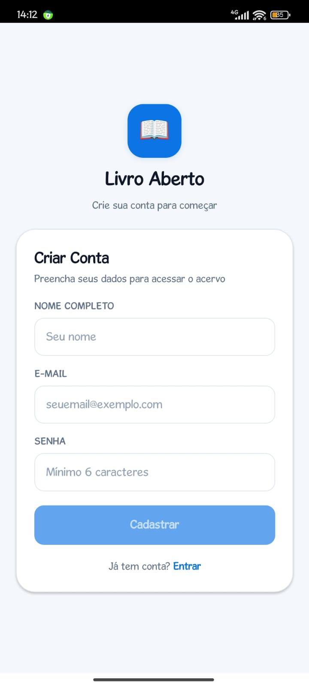 | 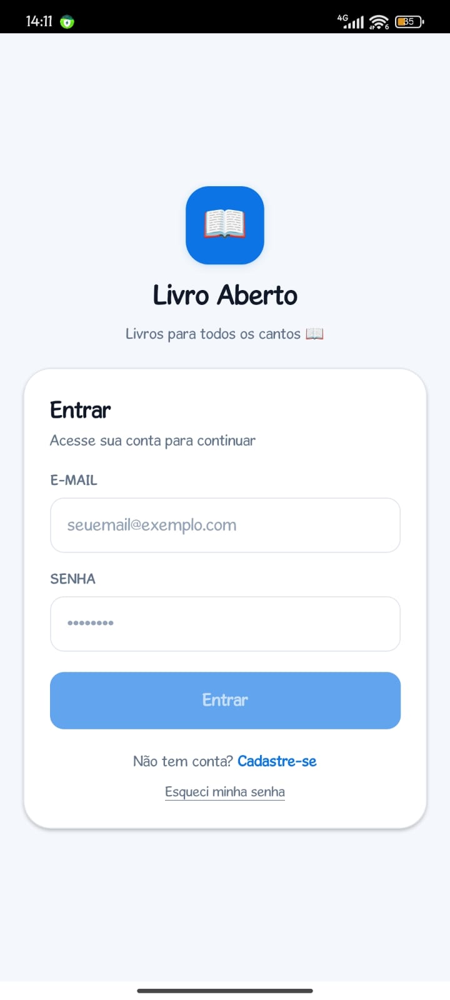 |
| *Criação de conta com validação de e-mail e senha* | *Login com token JWT gravado no SecureStore* |

---

### 📚 2. Exploração do Catálogo & Busca em Tempo Real

| Vitrine de Obras & Lançamentos | Pesquisa no Servidor |
| :---: | :---: |
| 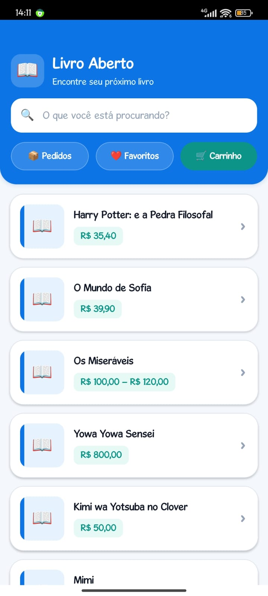 | 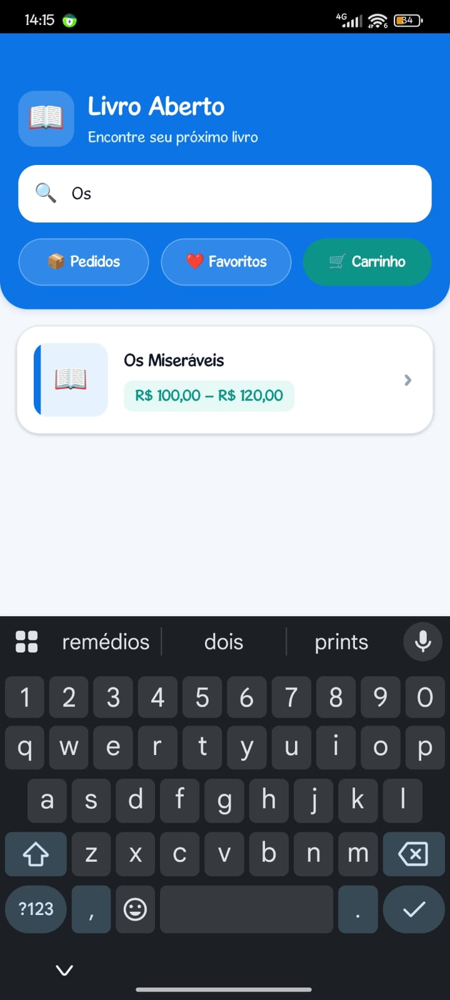 |
| *Listagem com miniaturas com lombada e pílulas de preço* | *Filtro dinâmico via query server-side ?search=* |

---

### ❤️ 3. Detalhes da Obra & Lista de Desejos

| Detalhe do Livro & Variantes | Meus Favoritos |
| :---: | :---: |
| 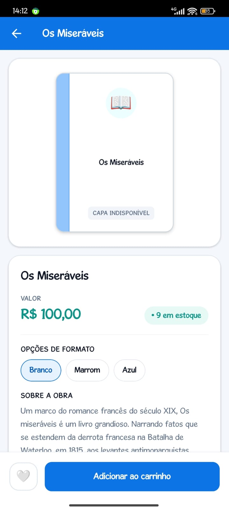 | 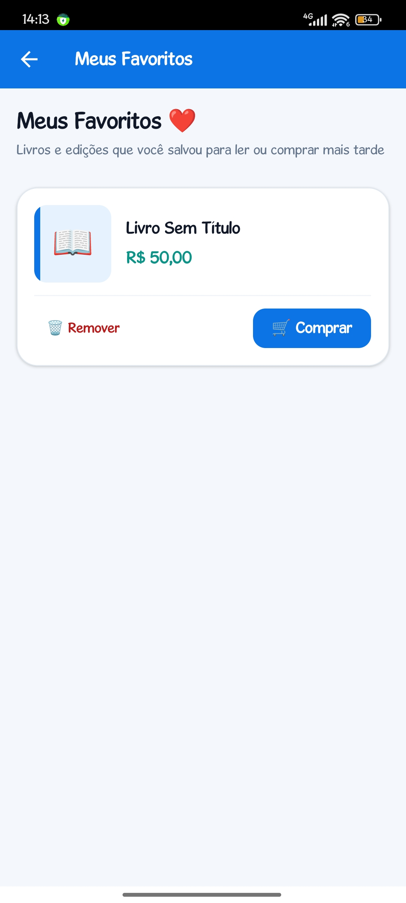 |
| *Seleção de formato, sinopse, estoque e botão de favoritar* | *Obras salvas com acesso rápido e botão de compra direta* |

---

### 🛒 4. Carrinho de Compras & Revisão de Checkout

| Meu Carrinho | Revisão do Pedido |
| :---: | :---: |
| 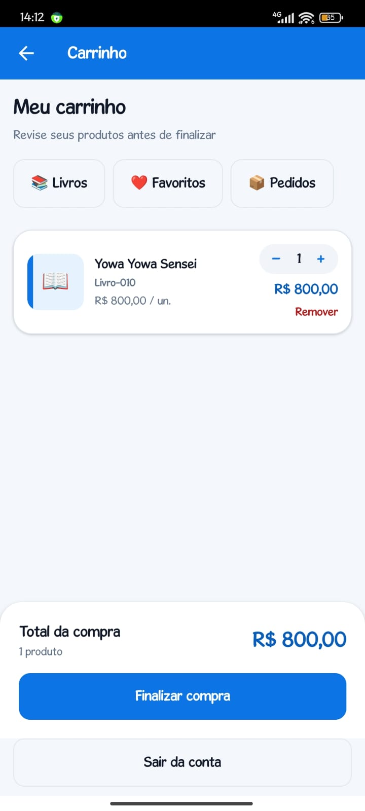 | 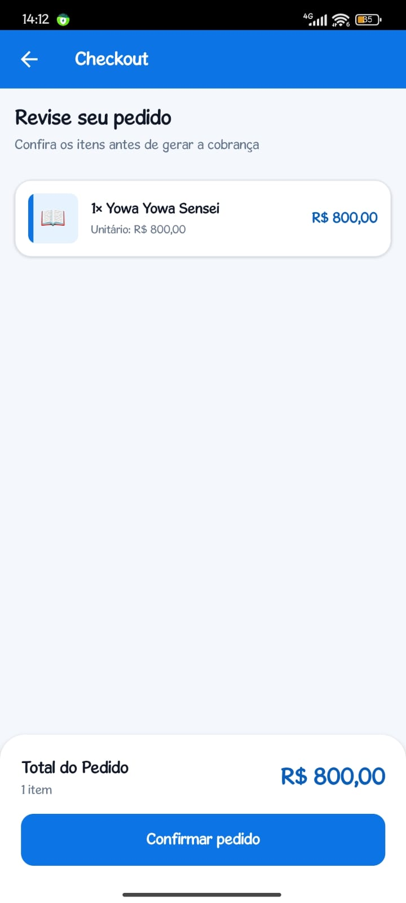 |
| *Mutações otimistas (+ / -), subtotais e valor total* | *Conferência de itens antes de gerar a cobrança* |

---

### 💳 5. Processamento de Pagamento & Linha do Tempo

| Pedido Aguardando Pagamento | Pagamento Aprovado (PAID) |
| :---: | :---: |
| 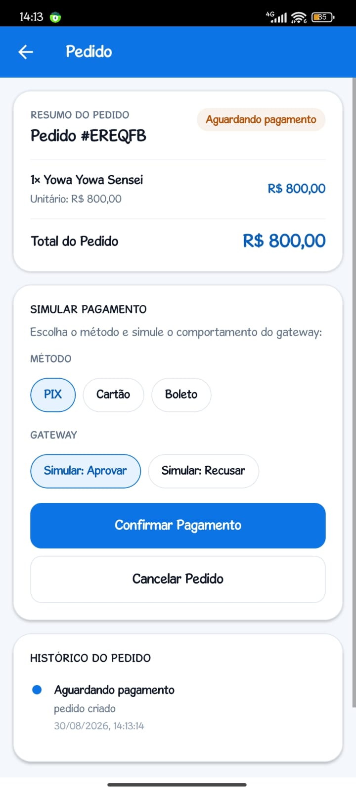 | 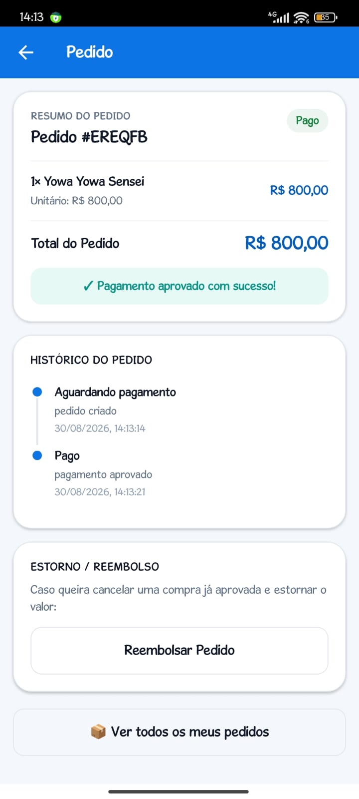 |
| *Simulação de gateway (Cartão, PIX, Boleto / Aprovar ou Recusar)* | *Transição para PAID e linha do tempo de auditoria* |

---

### 📦 6. Histórico de Compras & Reembolso

| Meus Pedidos | Estorno & Devolução de Estoque |
| :---: | :---: |
| 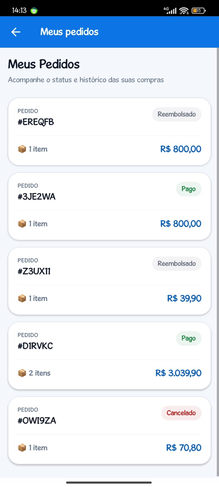 | 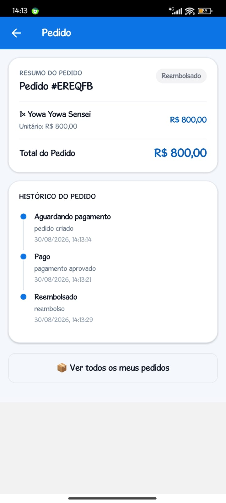 |
| *Listagem com badges de status, contagem de itens e total* | *Ação de reembolso de pedido com reversão de estoque* |

---

*Documento Oficial de Entrega — Livro Aberto · FIAP 2026 · Checkpoint 4*
